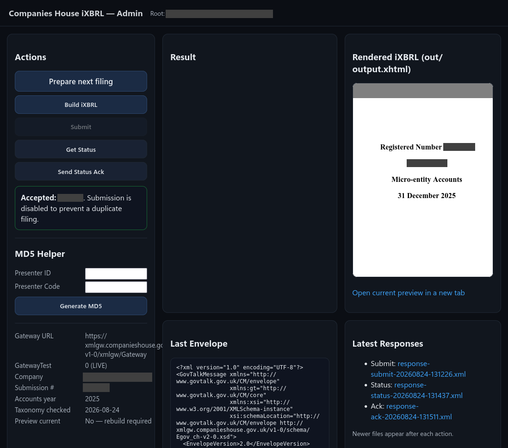

# CompaniesHouse-iXBRL

A small PHP application for building and submitting a single-file micro-entity iXBRL accounts document through the Companies House XML Software Filing Gateway.

It provides:

- a browser admin page for building, previewing, submitting, polling and acknowledging a filing;
- a separate **Prepare next filing** page for annual rollover;
- automatic transaction-ID progression;
- storage of gateway request/response records;
- checks that every `template.xhtml` placeholder has a configured value;
- a cache-busted iXBRL preview;
- a CLI preflight checker.

> **Important:** This is an independent, minimal project. It is not supplied, endorsed or supported by Companies House and is not accounting, legal or tax advice. Confirm that the accounts, eligibility, taxonomy, schema and gateway requirements are correct before every filing.

## Admin interface

The project includes a small admin interface for preparing the next filing, building the iXBRL output, previewing the rendered accounts and working through the Companies House submission/status/acknowledgement workflow.



*Example admin interface showing the filing workflow and rendered iXBRL preview.*

## Requirements

- PHP **7.4 or later**
- PHP cURL extension
- PHP DOM/XML extension recommended
- HTTPS
- a Companies House software filing presenter account and company authentication code
- a web server configuration that protects the **entire application directory**

Read the current Companies House guidance before using the project:

- Technical interface specifications: <https://www.gov.uk/government/publications/technical-interface-specifications-for-companies-house-software>
- Developer guidance: <https://www.gov.uk/government/publications/technical-interface-specifications-for-companies-house-software/important-information-for-software-developers-read-first>
- iXBRL validator: <https://find-and-update.company-information.service.gov.uk/xbrl_validate>
- Schema status: <https://xmlgw.companieshouse.gov.uk/SchemaStatus>

## Project layout

```text
admin.php                    Browser workflow
prepare.php                  Annual rollover/review page
gateway.php                  CLI-only gateway actions
config.php                   Non-secret application defaults
config.local.example.php     Presenter/company example configuration
filing.example.php           Initial annual filing example
storage/filing.php           Local annual filing data (created during setup)
template.xhtml               iXBRL template
src/                         PHP classes
out/                         Generated iXBRL, envelopes, responses and logs
storage/transaction_id.txt   Next transaction ID
storage/filing-backups/      Automatic annual-filing backups
tools/setup.php              Creates local runtime files
tools/preflight.php          Checks configuration and permissions
```

`config.local.php`, `storage/filing.php`, transaction state, generated output, logs and responses are excluded by `.gitignore`.

## Installation

### 1. Extract the project

Place it in a dedicated directory. Do not mix it with unrelated public website files.

### 2. Create local files

With command-line access:

```bash
php tools/setup.php
```

Or create them manually:

```bash
cp config.local.example.php config.local.php
cp filing.example.php storage/filing.php
printf 'ABC323456789DEF0' > storage/transaction_id.txt
```

The initial example identifiers are:

```text
Transaction ID:     ABC323456789DEF0
Submission number:  AC0001
Customer reference: IXBRL001
```

### 3. Configure presenter and company details

Edit `config.local.php`.

The presenter values placed in the gateway envelope are the **lowercase MD5 values** of the presenter ID and presenter code. The admin page includes a local MD5 helper. Paste only the generated hashes into:

```php
'presenter' => [
    'sender_id' => 'lowercase_md5_of_presenter_id',
    'auth_method' => 'clear',
    'auth_value' => 'lowercase_md5_of_presenter_code',
    'email' => 'you@example.com',
],
```

Do not commit `config.local.php` and do not store the plaintext presenter code in the project.

Keep:

```php
'gateway_test' => true,
```

until Companies House testing is complete. Setting it to `false` sends requests to the live gateway.

### 4. Configure the initial filing

Edit `storage/filing.php` and replace every example value:

- submission number and customer reference;
- signing/document dates;
- current and comparative periods;
- balance-sheet date and displayed years;
- every current and comparative financial fact;
- employee figures;
- statutory statements;
- approving officer and approval date.

Set each item under `checks` to `true` only after it has genuinely been verified. `taxonomy_schema_verified` must exactly match the configured `schemaRef`.

Example:

```php
'checks' => [
    'prepared_for_year' => '2024',
    'prepared_on' => '2025-01-01',
    'approval_date_confirmed' => true,
    'company_details_confirmed' => true,
    'eligibility_confirmed' => true,
    'figures_confirmed' => true,
    'taxonomy_verified' => true,
    'taxonomy_verified_on' => '2025-01-01',
    'taxonomy_schema_verified' => 'https://xbrl.frc.org.uk/FRS-102/2023-01-01/FRS-102-2023-01-01.xsd',
],
```

The dates and figures in `filing.example.php` are examples only.

### 5. Set permissions

The PHP/web-server user needs write access to:

```text
out/
out/logs/
storage/
storage/filing.php
storage/transaction_id.txt
storage/filing-backups/
```

The rest of the project should normally be read-only to the PHP user. Do not use `chmod 777`.

Example for a server where the deployment user owns the files and PHP runs in group `www-data`:

```bash
chown -R deploy:www-data /path/to/CompaniesHouse-iXBRL
find /path/to/CompaniesHouse-iXBRL -type d -exec chmod 0750 {} \;
find /path/to/CompaniesHouse-iXBRL -type f -exec chmod 0640 {} \;
chmod 0770 out out/logs storage storage/filing-backups
chmod 0660 storage/filing.php storage/transaction_id.txt
```

Adjust the user/group names to match the hosting environment.

### 6. Protect the application

The repository deliberately contains **no `.htaccess` file**, because absolute password-file paths and server capabilities differ.

Before opening `admin.php`:

- require authentication for the entire directory;
- use HTTPS;
- disable directory listing;
- keep the password file outside the web root;
- make sure PHP files are executed rather than served as source.

See [SECURITY.md](SECURITY.md) for Apache, Nginx and shared-hosting examples.

### 7. Run preflight

```bash
php tools/preflight.php
```

Do not submit while it reports failures. A passing preflight is not a substitute for checking the accounting and legal content.

## Browser workflow

Open:

```text
https://your-domain.example/path/admin.php
```

For an initial filing:

1. Complete `config.local.php` and `storage/filing.php`.
2. Run preflight.
3. Click **Build iXBRL**.
4. Review the embedded preview and open it in a new tab.
5. Validate `out/output.xhtml` using the official Companies House validator.
6. Confirm that the page shows the intended company, period, figures, submission number and gateway mode.
7. Click **Submit** once.
8. Click **Get Status** until the response is `ACCEPT`, `PENDING` or `REJECT`.
9. Click **Send Status Ack** after receiving a status.
10. Retain the generated files and responses.

An empty initial response body is only an acknowledgement that the gateway received the message. It is not acceptance. Acceptance is indicated by:

```xml
<StatusCode>ACCEPT</StatusCode>
```

## Annual rollover

After the current submission has a saved `ACCEPT` status response:

1. Open `admin.php`.
2. Click **Prepare next filing**.
3. Review the proposed incremented identifiers, periods, dates and carried-forward facts.
4. Enter the actual approval date.
5. Verify all figures, company details, eligibility and the currently accepted taxonomy.
6. Apply the changes.
7. Back on `admin.php`, click **Build iXBRL** and review the new output.
8. Submit once, poll the status and acknowledge it.

The rollover derives the balance-sheet date, displayed years and section 477 sentence from the new period end. It copies the old current-year facts into the new comparative column and pre-fills the new current-year column for review.

See [docs/ANNUAL-ROLLOVER.md](docs/ANNUAL-ROLLOVER.md).

## CLI workflow

`gateway.php` is intentionally CLI-only:

```bash
php gateway.php build-ixbrl
php gateway.php submit
php gateway.php status
php gateway.php ack
```

Opening `gateway.php` in a browser returns HTTP 403. This prevents a direct page visit from triggering a submission.

## Generated files

Typical runtime files include:

```text
out/output.xhtml
out/last-envelope.xml
out/response-submit-YYYYMMDD-HHMMSS.xml
out/response-status-YYYYMMDD-HHMMSS.xml
out/response-ack-YYYYMMDD-HHMMSS.xml
out/logs/gateway.log
storage/transaction_id.txt
storage/filing-backups/filing-YYYYMMDD-HHMMSS.php
```

These can contain credentials, company information and filing records. Keep them private and do not commit them.

## Taxonomy warning

The repository includes an FRC 2023 taxonomy configuration because it matches the supplied template. Taxonomy acceptance changes over time. Verify the current Companies House schema/taxonomy guidance before each filing. Do not change only `schemaRef`; namespaces, tags and the template may also need coordinated changes.

## Scope and limitations

This project is narrowly tailored to the included micro-entity accounts template. It does not determine whether a company qualifies as a micro-entity, whether it is dormant, whether an audit exemption applies or whether the figures/statements are correct.

The renderer checks for missing placeholders and well-formed XML, but it does not replace official iXBRL/business-rule validation.
